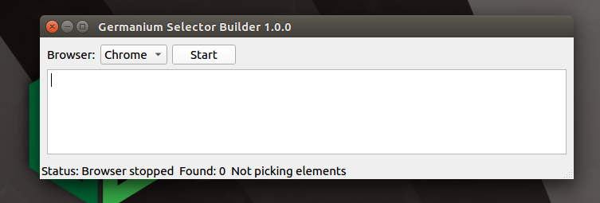
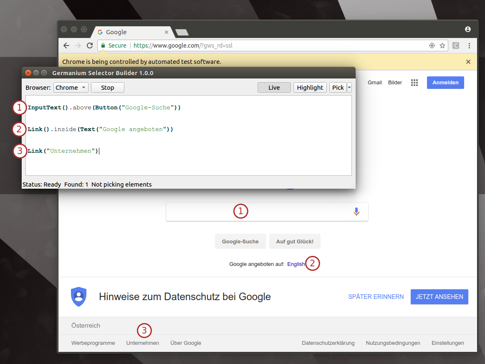

# Germanium Selector Builder 1.0.0

A simple yet powerful program to help you write Selenium selectors from
GermaniumHQ. Also supports Germanium selectors.

## Introduction

Selenium works with selectors to find the elements that the test will interact
with. For example to interact with the google search, after opening the
browser, to fetch the input element to type in a search something like this is
needed:

**Python Sample**

    wd.find_element_by_css_selector("input[name='q']")

**Java Sample**

    wd.findElement(By.css("input[name='q']"))

In order to find such elements, usually it’s needed to inspect the internal
structure of the page using the developer tools. It’s the responsibility of the
test creator to then determine the correct `CSS` or `XPath` selector that will
be used, to uniquely identify that element.

This is a tedious and error prone task, since even simple misspelling can cause
a lot of wasted time in trying to figure out why the selector isn’t matching
the elements.

That’s why the Germanium Selector Builder (`GermaniumSB` from here) was
written. In `GermaniumSB` you point your mouse to the element you want a
selector for, and you click it. The selector gets automatically written.

Then the selector can be copied into the test.

Multiple selectors can be edited at the same time in the editor, in the same
way as in an SQL tool. The current selector can be evaluated using the menu
entry `View` &gt; `Highlight`, or its shortcut `Ctrl+H` when the cursor is on the
line of the selector.

Germanium selectors are also fully supported, and can also be edited and
troubleshooted with syntax highlight.

In the generation of the selectors, depending on which element is selected, an
`XPath` or a `Css` selector will be generated. The type of the selector is
reflected in the function name.

## Usage

When opening `GermaniumSB` a window opens that allows code editing. In the code
section is where the editing of the selectors, commenting them, or highlighting
them for troubleshooting will take place.

At the top there is a combo box that allows selecting the browser to be used,
and that browser can be started using the `Start` button from the UI.

### UI Buttons

1.  `Start` / `Stop` - allows stopping and starting the browser. The browser can
    be used as usual, only when picking elements the browsers clicks will be
    consumed by `GermaniumSB` in order to find the elements. After that the
    browser will resume its normal operation.

2.  `Live` - can be toggled up and down to stop or start the polling of the
    browser;
    +
    `GermaniumSB` polls every 2 seconds the status of the browser, and ensures that
    all the necessary scripts are injected correctly, and to retrieve the elements
    that the user picked. Because of that it might be possible on some browsers
    that the developer tools are unnaccessible, namely they will automatically
    close when opened. This is a problem of the browsers, not `GermaniumSB`.
    +
    In order to allow the user to use the developer tools of the browser - it the
    unfortunate case they close on polling, toggling the `Live` mode inactive will
    pause the polling in the browser. Both the browser and the application can
    still be used, but no selector picking, nor highlighting of elements is
    possible.

3.  `Highlight` -when pressed will highlight the first element matching the selector
    where the cursor is, and will update the number of *all the elements that
    match the selector*. In case you have a flaky test it might happen because
    the selector is not specific enough, matches multiple elements and will get
    you in some runs the wrong element.

4.  `Pick` - that allows picking an element, for which the selector will be
    generated, with up to 4 parent references.
    +
    Parent references are what allows diferentiating selectors that otherwise
    would match too many elements. For example in a form that has many fields to
    fill in, we will want to select an input that corresponds to a specific
    label that’s in front of that input.
    +
    For that in `GermaniumSB` we would pick `Pick` &gt; `+1 reference`, select
    first the input, then the parent reference we want this input to be related
    to, namely the label. The Elements section in the status bar will say how
    many elements are still needed for selection in order to generate the
    selector.

### UI Status Bar

In the bottom left corner of the application, in the status bar there are three
sections:

1.  `Status` - The status of the application. This shows what’s the current
    state of the application. The available values are:  

    1.  Browser stopped - The browser needs to be started using the `Start`
        button.

    2.  Browser starting - The browser is starting up.

    3.  Loading monitoring - GermaniumSB is loading its support scripts in the
        browser.

    4.  Ready - Browser is ready. You can use it normally, click around, type,
        and from GermaniumSB highlight selectors.

    5.  Picking element - After you click the `Pick` button, you can click in the
        browser, to generate the selector for the clicked element.

    6.  Paused - Script running in the browser is disabled, to allow the use of
        the developer tools.

    7.  Computing selector - Germanium Selector Builder is computing the selector
        from the element.

    8.  Error - Something bad happened.

2.  `Found` - How many elements were found on the last highlight operation.
    +
    Whenever in Selenium you’ll try to find an element, if there are multiple
    elements matching that selector, there is a chance you’ll get another
    element when the test runs. To address this problem, Germanium Selector
    Builder will show you how many other elements, including the one you see
    being highlighted, matched the selector.

3.  `Elements` - How many elements should still be picked before a selector will
    be generated.

## Germanium Selectors

Beside generating Selenium selectors, Germanium Selector Builder allows
debugging Germanium selectors. All germanium selectors defined by the Germanium
API are available in the UI.

For example we could write the following selectors:

    Css("input[name='q']")                     # Selenium, using the pick
    InputText().above(Button("Google-Suche"))  # Germanium

    XPath("//div[string()='Google angeboten auf:  English  ']//a[string()='English']")
    Link().inside(Text("Google angeboten"))    # Germanium

    XPath("//a[string()='Unternehmen']")       # Selenium
    Link("Unternehmen")                        # Germanium

The *highlight selector* operation is available and works as expected. Also,
selectors can be multiline, including the positional filtering, or DOM
filtering like you can see in the 1st example in our list where we just define
an `InputText().above(Button("Google-Suche"))`.
